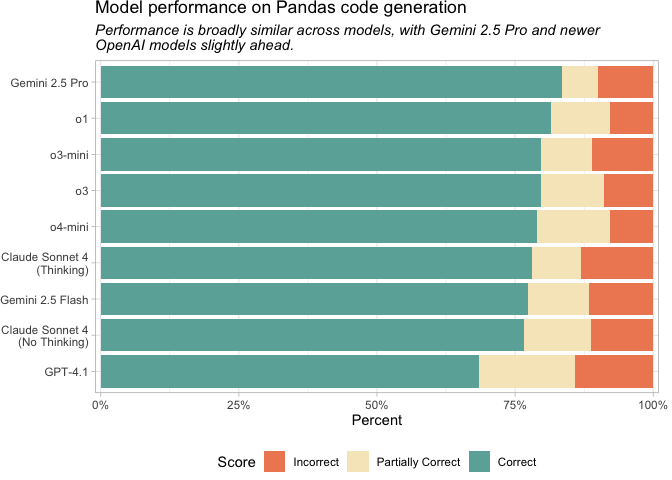
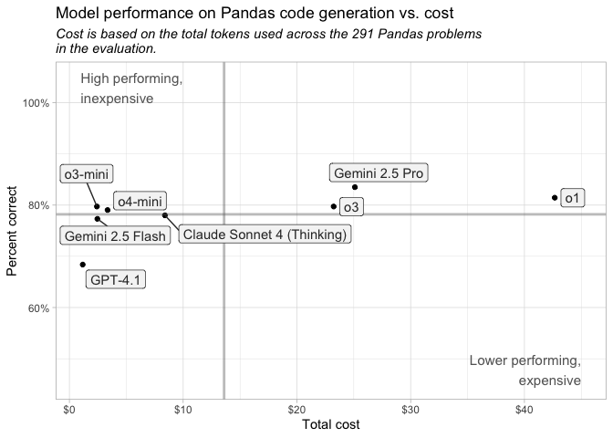

# Which AI model writes the best Pandas code?
Sara Altman, Simon Couch

**LLMs can now help you write Python code. There are many available
models, so which one should you pick?**

We looked at a handful of models and evaluated how well they each
generate Python code. To do so, we used
[Inspect](https://inspect.aisi.org.uk/), a Python framework for LLM
evaluation, and the [DS-1000
dataset](https://ukgovernmentbeis.github.io/inspect_evals/evals/coding/ds1000/),
a code generation benchmark for Python data science libraries. For this
evaluation, we limited DS-1000 to only the 291 coding problems that
involved Pandas.

## Current recommendation for Pandas: OpenAI o3-mini, o4-mini, or Claude Sonnet 4

**For Pandas coding tasks, we recommend using OpenAI’s o4-mini or
o3-mini or Anthropic’s Claude Sonnet 4.** The top models all performed
very similarly, but their prices vary substantially. **o4-mini, o3-mini,
and Claude Sonnet 4 are substantially less expensive than Gemini 2.5
Pro, o1, and o3** (see plot below). For Pandas code generation, we
expect that the additional cost will not translate to proportionally
better results.

> [!NOTE]
>
> ### Reasoning vs. non-reasoning models
>
> *Thinking* or *reasoning* models are LLMs that attempt to solve tasks
> through structured, step-by-step processing rather than just
> pattern-matching.
>
> Most of the models we looked at here are reasoning models, or are
> capable of reasoning. The only models not designed for reasoning are
> GPT-4.1 and Claude Sonnet 4 with thinking disabled.

> [!CAUTION]
>
> ### Take token usage into account
>
> A **token** is the fundamental unit of data that an LLM can process
> (for text processing, a token is approximately a word). Reasoning
> models, like o3-mini and o4-mini, often generate significantly more
> output tokens than non-reasoning models. So while some models are
> inexpensive per token, their actual cost can be higher than expected.
>
> For example, Gemini 2.5 Pro, which performed best in the evaluation,
> was the second most expensive model. Its per-token cost is only
> moderately high, but it used substantially more reasoning tokens than
> other models, bringing its token total usage to 1,797,682.

## Key insights

- **Most of the current frontier models perform similarly on the Pandas
  problems from DS-1000.**
- **OpenAI’s o4-mini and o3-mini perform similarly to the more expensive
  models (Gemini 2.5 Pro, o1, and o3).**
- **Claude Sonnet 4 performed similarly regardless of whether thinking
  was enabled.** This is similar to what we found for [R code
  generation](https://posit.co/blog/r-llm-evaluation/).

### Limitations

**DS-1000 is a commonly used dataset,** so it’s likely that the models
were exposed to some or all of these problems during training. This
means our results may be inflated compared to performance on more
realistic or complex Pandas tasks.

Because of this, **the exact accuracy numbers aren’t especially
meaningful.** Model-to-model comparisons are more informative than
absolute performance. Even those comparisons should be interpreted with
caution since DS-1000 is such a common benchmark. Ideally, we’d evaluate
models on an unseen test set, but building one (especially one as large
as DS-1000) is very time-consuming.

We [previously evaluated](https://posit.co/blog/r-llm-evaluation/) a
similar set of models on R coding tasks. That evaluation used a much
smaller and more challenging dataset (`are`, from the vitals package),
whereas the 291 DS-1000 Pandas problems are easier and likely appeared
in the training data for many models. **Because the evaluation datasets
differ so much in difficulty and familiarity, you shouldn’t compare
performance across the Python and [R
evaluations](https://posit.co/blog/r-llm-evaluation/). Instead, compare
models only within each evaluation.**

## Pricing

LLM pricing is typically provided per million tokens. Note that in our
analysis, Gemini 2.5 Pro, o1, o3, o3-mini, and o4-mini performed
similarly for Python code generation, but Gemini 2.5 Pro, o1, and o3 are
more expensive.

| Price per 1 million tokens |         |         |
|----------------------------|---------|---------|
| Name                       | Input   | Output  |
| Gemini 2.5 Pro             | \$1.25  | \$15.00 |
| o1                         | \$15.00 | \$60.00 |
| o3-mini                    | \$1.10  | \$4.40  |
| o3                         | \$10.00 | \$40.00 |
| o4-mini                    | \$1.10  | \$4.40  |
| Gemini 2.5 Flash           | \$0.30  | \$2.50  |
| Claude Sonnet 4            | \$3.00  | \$15.00 |
| GPT-4.1                    | \$2.00  | \$8.00  |

## What about other packages?

This evaluation focused only on Pandas problems. We excluded DS-1000
tasks that did not involve Pandas.

In future work, we plan to evaluate model performance on other common
Python data science libraries, including Polars. Anecdotally, we’ve
found that models struggle more with Polars code, and we’re interested
in testing this formally.

## Methodology

- We used [Inspect](https://inspect.aisi.org.uk/) to create connections
  to evaluate model performance on Pandas code generation tasks.
- We tested each model on a shared benchmark: the [DS-1000
  dataset](https://ukgovernmentbeis.github.io/inspect_evals/evals/coding/ds1000/).
  DS-1000 contains a collection of Python data science problems that
  involve various libraries, including Pandas, TensorFlow, and
  Matplotlib. To constrain our evaluation, we only included the 291
  Pandas problems present in the data.  
- Using Inspect, we had each model solve each Pandas problem. Then, we
  scored their solutions using a scoring model (Claude Sonnet 4). Each
  solution received a score of Incorrect, Partially Correct, or Correct.

You can see all the code used to evaluate the models
[here](https://github.com/skaltman/model-eval/eval.py). If you’d like to
learn more about LLM evaluation for code generation, see Simon Couch’s
series of [blog posts](https://www.simonpcouch.com/blog/) and the
[Inspect website](https://inspect.aisi.org.uk/).
